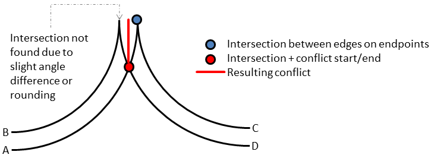
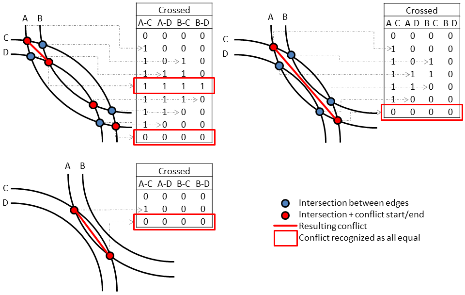

# Appendix A - Automatic derivation of conflict areas

The following algorithm is applied on two lanes after a quick contour check has determined that the two lanes may overlap.

1. Derive downstream and upstream lanes of both lanes, accounting for the direction of travel considered.
2. Derive left and right edges of lanes; called A and B for lane 1, C and D for lane 2.
3. Find all edge intersections of edges A-C, A-D, B-C and B-D. Each edge intersection has: fraction on lane 1, fraction on lane 2, edge combination it came from (the combination is later used by the algorithm).
4. All edge intersections are sorted by the fraction on lane 1 (lane 2 could also be used, this is arbitrary, so long as they are sorted).
5. If any downstream lane is equal:
    1. Merge conflict is made.
    2. Downstream point is the end of both lanes.
    3. Upstream point is: the most downstream edge intersection of either A-D or B-C (i.e. intersection of a left and a right edge).
    4. Any edge intersections on A-C and B-D further downstream from the conflict start are removed, e.g. the blue point in the figure below. Edge intersections at endpoints are unreliable and of no use to the algorithm.

_Figure A.1: Conflict derivation at lane end (or start)._

6. If any upstream lane is equal, a split conflict is made. This occurs the same as a merge conflicts, but reversed. Any edge intersections upstream of the end of the conflict are removed.
7. Remaining edge intersections are used to derive crossing conflicts. This is conceptually more difficult, as there can be multiple crossing conflicts on a pair of lanes. For instance, two left-hand curves over an intersection may cross twice, or overlap once in various extents. However, a simple algorithm can be used to derive crossing conflicts: 
    1. Initialize the value 'crossed' of each edge combination of edges to 0 or 'false' (first row in tables in the figure below).
    2. Loop over the ordered edge intersections of all edge combinations. For each edge intersection: 
        a. The first intersection is the start of a conflict. 
        b. Flip the 'crossed' state (1 <=> 0, true <=> false) of the edge combination from which the edge intersection came (this is why each edge intersection stores two lane fractions and an edge combination). 
        c. If all 4 'crossed' states are equal, either the lanes have completely crossed (upper left example in the figure below), or those edges that have crossed have also crossed back to the original side (upper right and lower left examples in the figure below). Thus, the edge intersection marks the end of a conflict (red boxes in the figure below). 
        d. The process repeats for remaining edge intersections, the first next edge intersections is the start of the next conflict (see upper left example in the figure below).

_Figure A.2: Derivation of crossing area._

